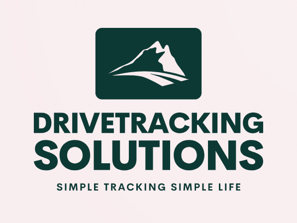
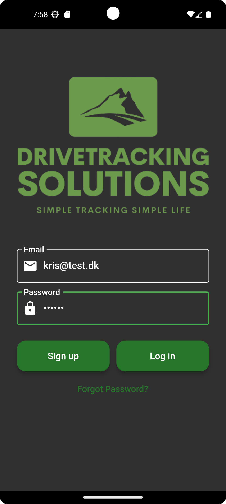
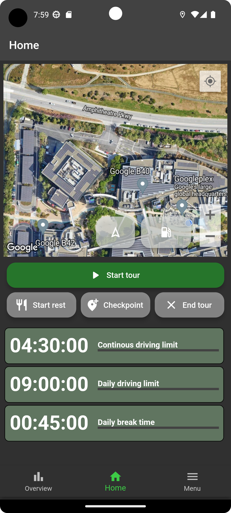
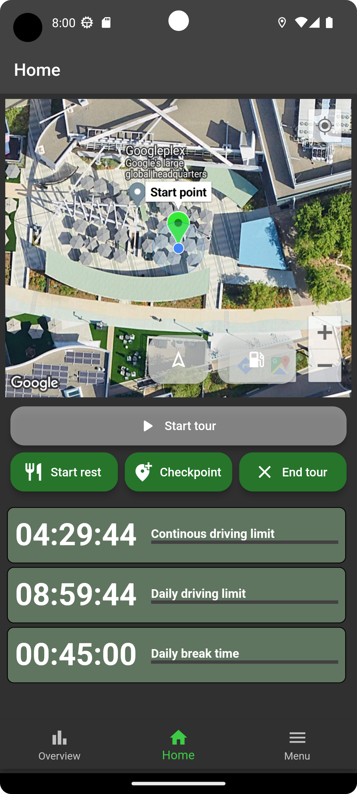
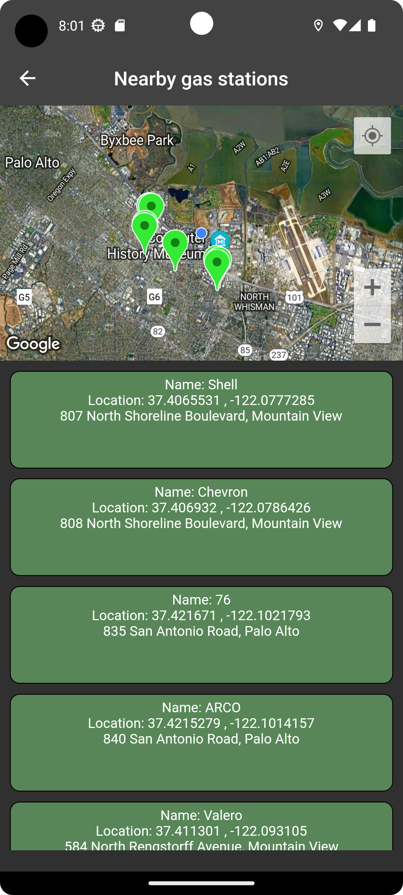
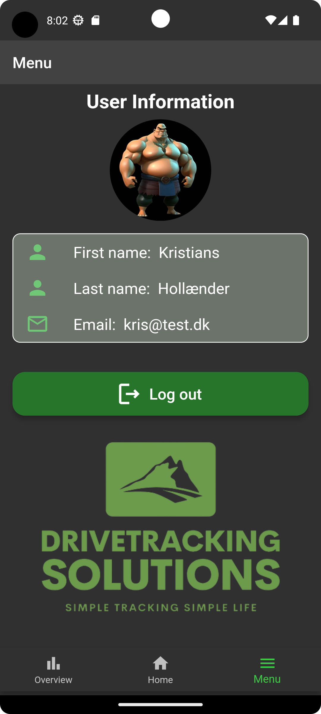
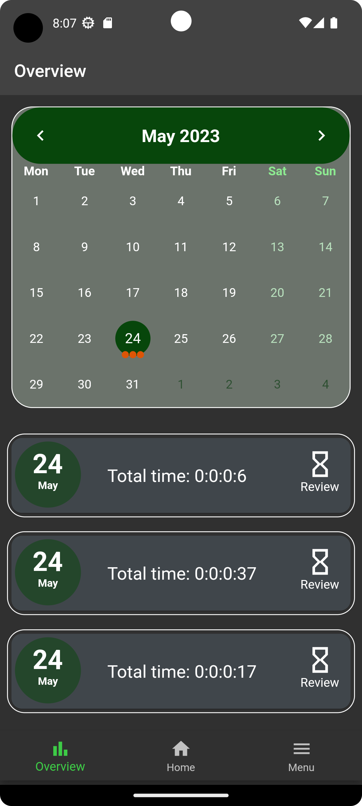
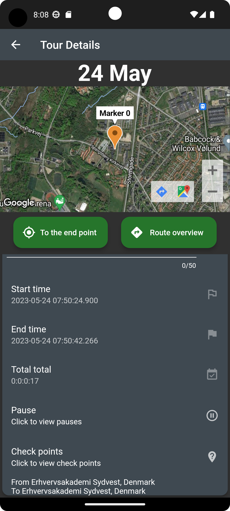

 # Drive Tracking Solutions


Drive Tracking Solutions is a project aimed at facilitating truck drivers in keeping track of their driving hours on a daily basis, based on national as well as international regulations. While doing so it also provides features for setting checkpoints during a tour and monitoring resting times and many more.

## :iphone: Flutter App

The primary focus of this project is a mobile app built using the Flutter Framework. The app offers a user-friendly interface for truck drivers to track their driving hours and manage checkpoints. It utilizes a Firebase backend for data storage and synchronization.

## Features
- Create user
- Update user
- Start tour
- Start rest 
- Set checkPoints
- End rest
- End tour
- Get gas stations nearby
- Get all personal tours
- Get tour details on map via Google maps api
- Add note on tour

## Setup Instructions Mobil Application 

Before running the project, ensure that you have the following prerequisites in place:

Use the package manager [pub](https://dart.dev/tools/pub/cmd/pub-get) to install all dependencies.

```bash
dart pub dev get
```

## :satellite: Web application

In addition to the mobile app, this project includes an admin page designed for administrators to monitor the driving activities of individual truckers. The admin page provides insights into their driving hours, locations visited, and adherence to required rest periods.

The web application is built using the Angular Framework and utilizes the same Firebase backend as the Flutter app for seamless data integration.

## Features
- Login 
- Create user
- Update user
- Get all users
- Get all tours
- Get tour details on map via Google maps api

## Setup Instructions Web Application 

Before running the project, ensure that you have the following prerequisites in place:

Use the package manager [npm](https://docs.npmjs.com/) to install all dependencies.

```bash
npm install
```

## :camera: Screenshots of DriveTrackingSolution
<details>
   <summary>Login</summary>
   
</details>

<details>
   <summary>Home screen</summary>
   
</details>

<details>
   <summary>Start tour</summary>
   
</details>

<details>
   <summary>Get gas stations nearby</summary>
   
</details>

<details>
   <summary>User info</summary>
   
</details>

<details>
   <summary>Tour overview</summary>
   
</details>

<details>
   <summary>Tour details</summary>
   
</details>

## :computer: Technologies


## :pencil2: Authors

* [@Andy Laa](https://github.com/Andylaa10/)
* [@Marcus Iversen](https://github.com/MarcusIversen/)
* [@Kristian Hollænder](https://github.com/kristianHollaender/)
